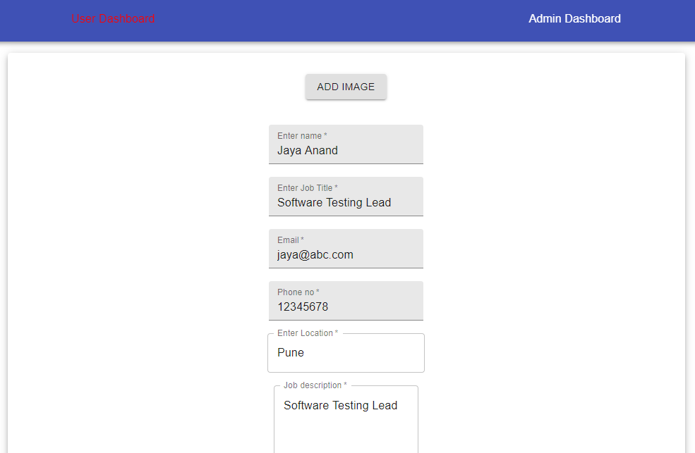

# Job-Seeker-App
A small website for job seekers

```
git clone https://github.com/Jigyasa08/Job-Seeker-App.git


npm install

* backend/AuthAPI
nodemon server.js

* backend/UserAPI
nodemon server.js

* frontend
npm install
npm run start

```

# Screenshots

# User Login Page


# User Dashboard


# User Dashboard Details Page


# Admin Login Page


# Admin Dashboard Page


# Admin Edit Page


# Tech Stacks Used

## Front End Technologies
* HTML5
* CSS
* Javascript

## Frontend Framework
* React.Js

## Back End Technology
* Node.Js

## Back End Framework
* Express

## Database Development Technologies
* MongoDB
* NoSQL

## Libraries Used
* React
* React-Redux
* Material UI
* Redux
* Redux Thunk
* Axios
* React-Router-DOM
